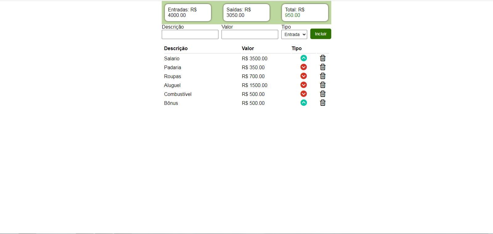

<h1 align="center"> Controle Financeiro </h1>

Programa apresentado como aula no canal Will Dev no YouTube.  

  <a href="#-tecnologias">Tecnologias</a>&nbsp;&nbsp;&nbsp;|&nbsp;&nbsp;&nbsp;
  <a href="#-projeto">Projeto</a>&nbsp;&nbsp;&nbsp;|&nbsp;&nbsp;&nbsp;
  <a href="#-layout">Layout</a>&nbsp;&nbsp;&nbsp;|&nbsp;&nbsp;&nbsp;
  <a href="#memo-licença">Licença</a>

 

  

## 🚀 Tecnologias

Esse projeto foi desenvolvido com as seguintes tecnologias:

- HTML e CSS
- JavaScript
- Git e Github
- DOM
- Local Storage

## 💻 Projeto

O controle financeiro é um simples de controle de entradas e saídas apresentando o saldo atualizado do caixa, utilizei como aprendizado de utilização de uso Tbody, input e funções DOM, CSS, Javascript e Local Storage.
Inseri algumas modificações como uma cor no fundo dos saldos e cor interativa do saldo total, conforme a situação do caixa, sendo vermelho saldo negativo, preto saldo zerado e saldo positivo em verde.

## 🔖 Layout

Você pode visualizar o layout do projeto no canal Will Dev no YouTube.

---

Feito com ♥ by Wellington Sato